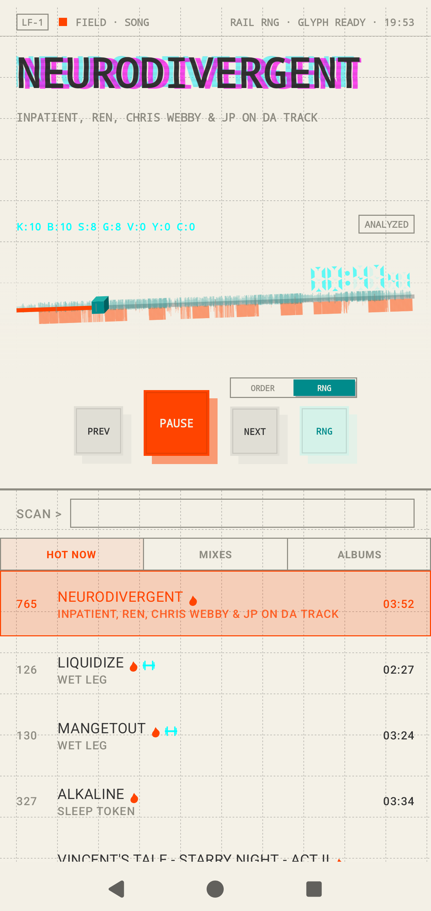
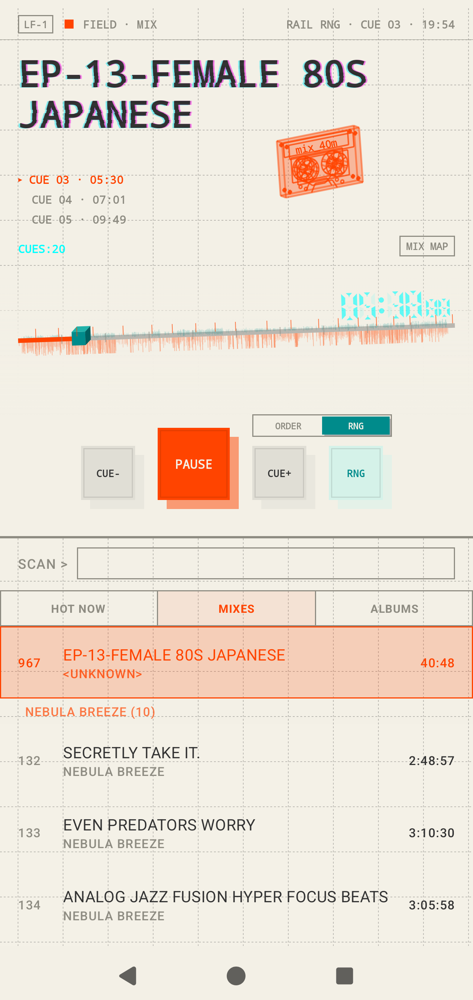
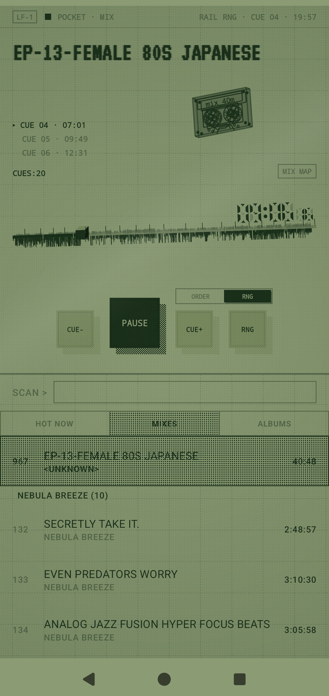
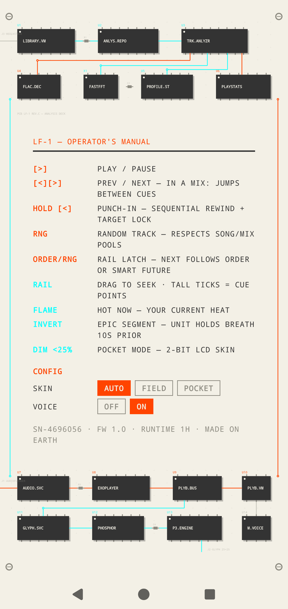

# LE FLAC

**LF-1** · a FLAC instrument for Android — built on a Nothing Phone (3)

> Most software is built outside-in — features wearing a skin.
> This unit was built inside-out. The skin *is* the feature set.

LE FLAC is a local-only music player that behaves like a piece of field
equipment: it analyses every track it touches, knows where the drops are
before they arrive, keeps a clock on its sleep screen, prints its manual
and its own circuit diagram on the back of the chassis, and runs a 25×25
LED cassette deck on the Glyph Matrix. LF-1 1.2 is also a projected, browsable
Android Auto media source and adds a persistent, explicit UP NEXT bus without
adding a network permission.

<p align="center">
  
  
</p>
<p align="center">
  
  
</p>

## NO GARBO

**No network. No accounts. No telemetry. No analytics. No tracking. No
ads. No cloud.** The app has no INTERNET permission to misuse — every
byte of analysis happens on the device, every preference stays in the
chassis, and the only recommendations are the ones it learns from your
own plays and skips. If you delete it, nothing anywhere remembers you
had it.

---

## SPECIFICATIONS

| | |
|---|---|
| MODEL | LF-1 "LE FLAC" |
| FORMATS | FLAC · MP3 · AAC · OGG · WAV (16-44 → 24-192) |
| SKINS | FIELD (chassis beige · safety orange · cyan) · POCKET (2-bit 1989-handheld LCD, Bayer-dithered, no alpha anywhere) |
| MATRIX | 25×25 Glyph: turntable, cassette, sleeping ampelmann, punch-in shutter, plate clock |
| ANALYSIS | full-track FFT at import · epic-segment detection · cue extraction · BPM · drive profiling |
| MEMORY | play/skip stats with 45-day half-life · persistent FIFO UP NEXT · mix resume positions · lifetime runtime, etched on the chassis |
| CAR DECK | Android Auto browse · host voice requests · resume · steering-wheel transport · POCKET artwork by default, FIELD selectable |
| DISPLAY DRIVER | AGSL CRT raster: scanline tear, phosphor lines, periodic magnet pass with degauss snap-back |
| REQUIRES | Android 14+ · a Nothing Phone (3) for the Matrix · a compatible Android Auto host for the car deck |

---

## FOUR PLATES

The face of the unit is a strict vertical stack, registered to the
chassis grid — every seam lands on a printed line.

```
┌──────────────────────────────────┐
│ LF-1  ● FIELD · SONG   RAIL · ⏱ │  SYSTEM STRIP   mode, rail, glyph state
├──────────────────────────────────┤
│  CHOKEHOLD                       │  FACEPLATE      the music is the hero
│  SLEEP TOKEN · TAKE ME BACK…     │
│  K:4 B:7 S:2 …        [ANALYZED] │
├──────────────────────────────────┤
│  ───────▮────────────  02:14     │  TRANSPORT      one hardware baseline
│  PREV  PLAY  NEXT  RNG [ORDER|RNG]│
├──────────────────────────────────┤
│  SCAN > _                        │  LEDGER         choosing, calm
│  HOT │ MIXES │ ALBUMS │ NEXT 02  │
│  295 CHOKEHOLD ········· 05:04   │
└──────────────────────────────────┘
```

One thing is loud at a time. The current track may glitch, bow, and tear
like type on a mistreated CRT; the library below it stays a readable
ledger. Orange means current/action/hot. Cyan means RNG/analysis/deck.
Ink means ORDER. Dim means engraved.

## THE UNIT KNOWS THE FUTURE

Every track is decoded once and analysed offline. From that single pass:

- **Epic segments** — judged *song-relative*: a section qualifies only if
  the song itself has dynamics (P90−P25 energy contrast). A loudness-war
  master gets zero drama, a Sleep Token climax gets exactly its climaxes.
  Ten seconds before a drop the UI holds its breath: grid dims, telemetry
  fades — then the punch.
- **Cue points** — track boundaries inside DJ mixes, found as novelty
  peaks. While a mix plays, the faceplate prints a cue ladder (tap a row
  to jump the tape), the transport buttons become CUE−/CUE+, and the
  system strip counts cues instead of advertising the Glyph.
- **Drive profiles** — mean kick density, flatness, tempo. The drama
  detector's reject pile ("loud all the time means loud is not special")
  turns out to be the perfect gym playlist. We kept the reject pile.

## TWO RAILS

`NEXT` follows one of two futures. The **ORDER** rail is deterministic —
the album, in order. The **RNG** rail is a smart generated future —
favourites re-injected every 5–20 tracks, never the same artist
back-to-back, never a mix invading a song queue. A small slide switch
above NEXT and RNG shows which rail owns the future; holding PREV/NEXT
forces the ORDER rail no matter what. `RNG` itself is a one-shot random
jump — a real button, never a mode.

**UP NEXT outranks both rails.** Hold a track to open the loader, tap more
tracks in the order you want them, then press `[QUEUE]`. The `NEXT nn` ledger
tab shows the FIFO priority bus and provides per-item remove and clear controls.
Normal track taps still mean play now. A play-now selection starts a new
context and clears the previous explicit schedule; changing ORDER/RNG preserves
it. Song and mix pools remain separate. The exact behavior and edge cases are
in [`docs/UP_NEXT.md`](docs/UP_NEXT.md).

## HOT NOW

Plays are credited scrobble-style (≥50% or 4 minutes). Skips count
against. Everything decays with a 45-day half-life, so the unit follows
your taste instead of your history. Hot tracks wear a flame; albums
holding one wear it on the tile.

## DECK PROMPT

The ledger's SCAN line is a prompt. It filters as you type, and it takes
verbs (`.` or `>` — the dot needs no keyboard switch):

```
.hot     your current heat
.gym     the training set — drive × tempo × your own heat. heat wins.
.mix     every cassette
.rng     ten at random
```

Playing from `.gym` starts a **gym session**: the queue locks to the
training pool until you tap `[GYM · TAP TO END]` in the system strip.

## THE GLYPH TOY

The matrix is the second screen, and arguably the first:

- **Playing** — a spinning turntable with live instrument zones; a
  cassette whose reels trade tape as a mix progresses.
- **Paused** — the ampelmann sleeps, Zs drift, a quiet 24-hour clock
  keeps watch. Same scene on the always-on display.
- **The button** — press and hold: shutter plates close over the live
  animation with the time printed on them. Release early — you just
  checked your watch. Hold on — the plates meet, the punch-in fires,
  playback toggles, and the shutter reopens on the new state. The punch
  keys off the *real* player state, so it can never reveal a lie.

## THE BACK OF THE UNIT

Tap the LF-1 nameplate in the system strip and the whole device flips
over. On the back: the operator's manual, silkscreened over the unit's
*actual* circuit — every IC package is a real source file, every trace a
real call path.

```
   J3·MEDIASTORE ─┐                         J4·ANDROID AUTO
   ┌U1────────┐  ┌U2────────┐  ┌U3────────┐
   │LOCAL.LIB ├──┤ANLYS.REPO├──┤TRK.ANLYZR│      analysis deck
   └──────────┘  └──────────┘  └─┬──┬──┬──┘
   ┌U4──────┐  ┌X1─────┐  ┌U5────┴┐ ┌┴U6───────┐
   │FLAC.DEC│  │FASTFFT│  │PROFILE│ │PLAYSTATS │
   └────────┘  └───────┘  └───────┘ └──────────┘
        ·  ·  ·  [ operator's manual here ]  ·  ·  ·
   J1·AUDIOFLINGER ─┐
   ┌U7───────┐  ┌U8───────┐  ┌U9──────┐  ┌U10────┐
   │AUDIO.SVC├──┤EXOPLAYER├──┤PLYB.BUS├──┤PLYB.VM│  playback deck
   │    └──── MEDIA.LIBRARY SESSION ──────────── J4│
   └─────────┘  └─────────┘  └───┬────┘  └───────┘
   ┌U11──────┐  ┌U12─────┐  ┌U13─┴─────┐
   │GLYPH.SVC├──┤PHOSPHOR├──┤P3.ENGINE ├── J2·GLYPH 25×25
   └─────────┘  └────────┘  └──────────┘
```

DIP switches for phone skin override, Android Auto car skin, and machine
voice. The car defaults independently to POCKET so phone brightness can
never change the dashboard personality. A serial number is minted on first
run. Your lifetime listening hours are etched. First launch opens on the
back, because unboxing means reading the manual.

## FIELD / POCKET

Dim the screen below 25% (or flip the DIP) and the unit becomes a
different device: 1989-handheld LCD glass, pixel font, two-bit tone
ramp, Bayer dithering where alpha used to be. The CRT effects stay on
the FIELD skin — a passive matrix doesn't bend near a magnet, so
POCKET's title ghosts like slow pixels instead. Hardware conditions,
not styles.

## ANDROID AUTO / HONDA e

Android Auto sees LF-1 as an offline Media3 library with up to four parked-safe
destinations: **Hot now**, **Albums**, **Mixes**, and **All songs**. Selecting
a song builds a songs-only queue; selecting a mix builds a mixes-only queue,
preserving the unit's existing separation. Voice requests delivered by the host
are resolved against local media; the first Honda e voice run remains a live
acceptance check.

Phone-scheduled UP NEXT items live in that same Media3 timeline, so automatic
transitions and steering-wheel NEXT consume them before returning to ORDER/RNG.
Hosts decide whether to expose their standard queue page; no extra car browse
destination is required.

The head unit owns its typography, chrome, and final layout. `CAR SKIN` on
the rear panel therefore controls the parts LE FLAC is allowed to own:
browse/now-playing artwork and content-style hints. It defaults to **POCKET**;
**FIELD** uses the beige/orange/cyan instrument palette. Hosts may override
layout hints, but playback and browsing do not depend on them. Because Android
shares one media session between the car and system controls, this artwork can
also appear in the phone's notification/lock-screen media card; the Compose
faceplate itself remains on its independent `SKIN` setting.

For the first Honda e test, install and open LE FLAC once, grant **Music and
audio**, then connect while parked using the Android Auto data USB port and
a certified data cable. Sideloaded builds require Android Auto developer mode
and **Unknown sources**. The complete live-car checklist and DHU commands are
in [`docs/ANDROID_AUTO.md`](docs/ANDROID_AUTO.md).

## OPERATING

```sh
scripts/fetch_glyph_sdk.sh  # one-time: pull the Glyph Matrix SDK from
                            # Nothing's official developer kit (their
                            # license forbids us bundling it)
make run                    # build, install, launch on a connected phone
make install-phone          # same-key upgrade; preserves library/settings
make build                  # assemble the APK
./gradlew testDebugUnitTest # the test bench
scripts/push_music.sh DIR   # push a folder of music to the device
```

The exact phone-tested sideload build is attached to the
[v1.2.0 GitHub release](https://github.com/mandrigin/leflac/releases/tag/v1.2.0).
That APK uses the development/debug signing key and is intended for direct
testing, not store distribution. Upgrade preservation requires the installed
copy to use the same signing key. Version 1.2.0 uses Media3 1.10.1 and API 36
build tooling while retaining target SDK 34 for the initial sideloaded Honda e
validation. It needs a local
music library (it scans MediaStore) and, for the full experience, a
Nothing Phone (3) with the Glyph Matrix. Add LE FLAC as a Glyph Toy in
settings; transport and track-loader long presses are deliberate, by design. The
design spec lives in `docs/` — the organization mockup is the drawing
this faceplate was built from.

Issues are welcome. PRs that add garbo will be politely declined —
read NO GARBO first; it is load-bearing.

## OPERATOR'S NOTES

- The boot self-test runs once a day. Surprise has a half-life.
- When the unit rests, everything rests. Stillness is what makes the
  active state feel alive.
- The flame means heat. The barbell means drive. The inversion means now.
- Analysis caches are gzipped and disposable; profiles and stats are not.
- If the glyph button goes quiet after an update, re-add the toy. The
  system holds grudges against rebinding.

## LICENSE

Apache License 2.0 — see [LICENSE](LICENSE) and [NOTICE](NOTICE).

Third-party parts on the board:

| PART | ORIGIN | TERMS |
|---|---|---|
| Glyph Matrix SDK | © Nothing Technology Limited | Nothing's developer terms — no redistribution, so it is **not** in this repo; `scripts/fetch_glyph_sdk.sh` pulls it from [the official developer kit](https://github.com/Nothing-Developer-Programme/GlyphMatrix-Developer-Kit) |
| Media3 1.10.1 · AndroidX · Gson | Google | Apache-2.0 |
| JTransforms | Piotr Wendykier | BSD-2 |
| VT323 (`lcd_font`) | Peter Hull | SIL OFL 1.1 |
| Press Start 2P (`pixel_font`) | CodeMan38 | SIL OFL 1.1 |

---

SN-XXXXXXX · MADE ON EARTH · WITH LOVE AND LOTS OF AI · NO USER SERVICEABLE PARTS INSIDE
*(there are, in fact, only user serviceable parts inside — it's source code)*
